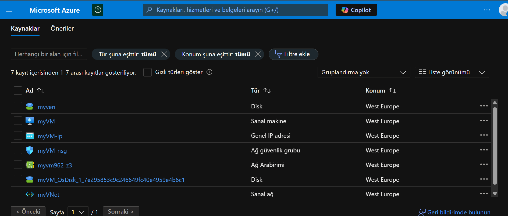
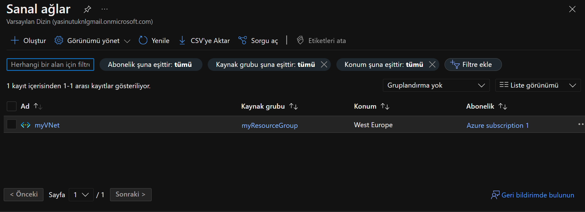
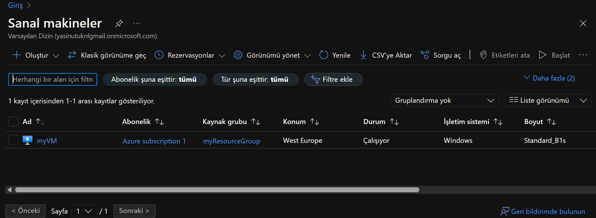
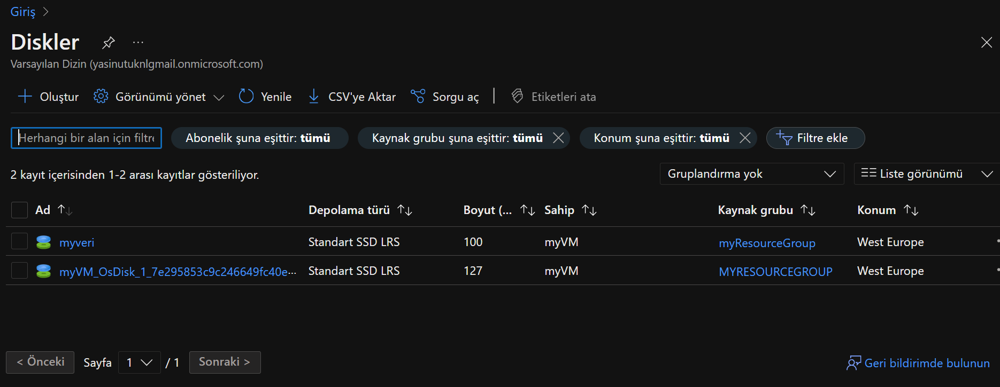
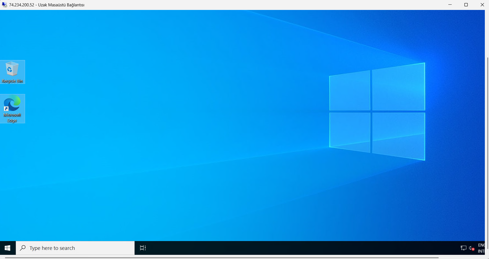
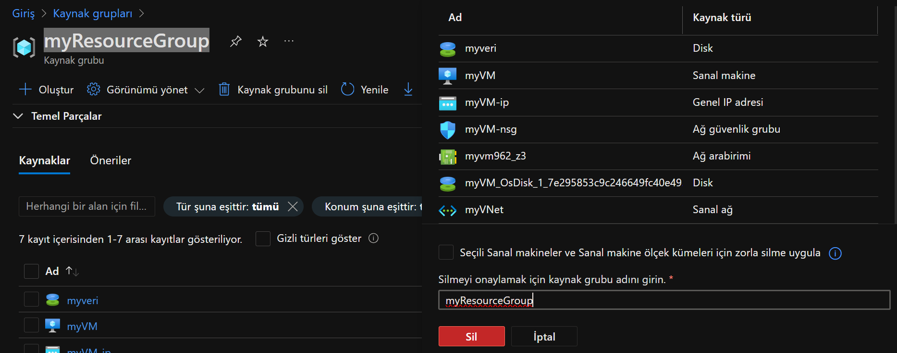

# Azure Virtual Machine Setup Assignment

This repository explains the step-by-step process of setting up a Windows Server virtual machine on Azure. The following steps were performed as part of this assignment:

1. **Create a Resource Group**
2. **Set Up a Virtual Network (VNet)**
3. **Deploy a Windows Virtual Machine**
4. **Attach a Data Disk to the VM**
5. **Connect to the VM via RDP**
6. **Clean Up Resources (Optional)**

---

## Step 1: Create a Resource Group
A new resource group was created in the Azure Portal. The resource group is used to organize all Azure resources.

---

## Step 2: Set Up a Virtual Network (VNet)
A virtual network with a default subnet was created. The virtual network allows virtual machines to communicate with each other and the outside world.

---

## Step 3: Deploy a Windows Virtual Machine
A Windows Server virtual machine suitable for the free tier was created. A public IP address was assigned for RDP access.

---

## Step 4: Attach a Data Disk to the VM
An additional data disk was attached to the created virtual machine. This disk provides extra storage space.

---

## Step 5: Connect to the VM via RDP
The virtual machine was connected to using the Remote Desktop Protocol (RDP) with the public IP address.

---

## Step 6: Clean Up Resources (Optional)
To avoid unnecessary charges, the resource group and all resources were deleted.

---

## How to Run
1. Sign in to the Azure Portal.
2. Follow the steps to create the virtual machine.
3. Connect to the VM using RDP.

---

## Contribution
This repository was created as part of an assignment. Feel free to contribute by opening a Pull Request.

---

## License
This project is licensed under the MIT License. See the `LICENSE` file for more details.