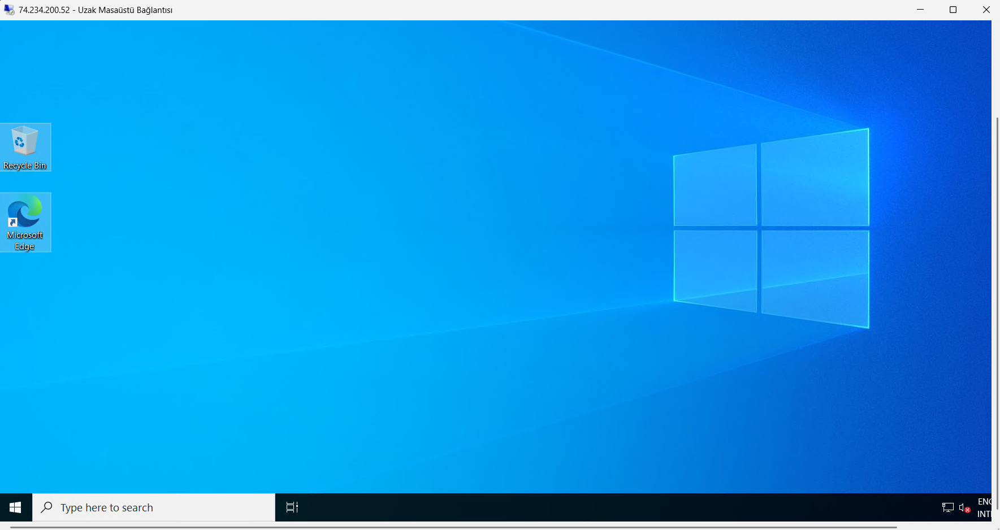
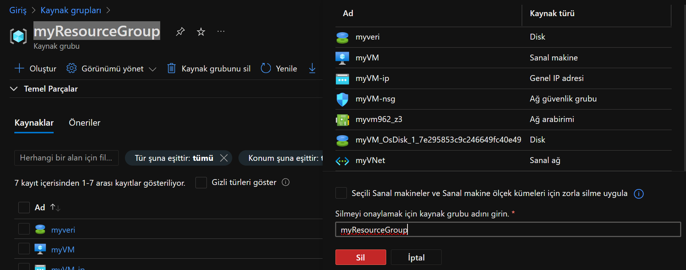

# Azure Virtuele Machine Opdracht

Deze repository legt het stapsgewijze proces uit voor het opzetten van een Windows Server virtuele machine op Azure. De volgende stappen zijn uitgevoerd als onderdeel van deze opdracht:

1. **Maak een Resourcegroep**
2. **Stel een Virtueel Netwerk (VNet) in**
3. **Implementeer een Windows Virtuele Machine**
4. **Koppel een Gegevensschijf aan de VM**
5. **Verbind met de VM via RDP**
6. **Ruim Resources Op (Optioneel)**

---

## Stap 1: Maak een Resourcegroep
Een nieuwe resourcegroep is gemaakt in de Azure Portal. De resourcegroep wordt gebruikt om alle Azure-resources te organiseren.

---

## Stap 2: Stel een Virtueel Netwerk (VNet) in
Een virtueel netwerk met een standaard subnet is gemaakt. Het virtuele netwerk stelt virtuele machines in staat om met elkaar en de buitenwereld te communiceren.

---

## Stap 3: Implementeer een Windows Virtuele Machine
Een Windows Server virtuele machine geschikt voor de gratis laag is gemaakt. Een openbaar IP-adres is toegewezen voor RDP-toegang.

---

## Stap 4: Koppel een Gegevensschijf aan de VM
Een extra gegevensschijf is gekoppeld aan de gemaakte virtuele machine. Deze schijf biedt extra opslagruimte.

---

## Stap 5: Verbind met de VM via RDP
Er is verbinding gemaakt met de virtuele machine met behulp van het Remote Desktop Protocol (RDP) en het openbare IP-adres.

---

## Stap 6: Ruim Resources Op (Optioneel)
Om onnodige kosten te voorkomen, zijn de resourcegroep en alle resources verwijderd.

---

## Hoe te Gebruiken
1. Meld je aan bij de Azure Portal.
2. Volg de stappen om de virtuele machine te maken.
3. Verbind met de VM via RDP.

---

## Bijdrage
Deze repository is gemaakt als onderdeel van een opdracht. Voel je vrij om bij te dragen door een Pull Request te openen.

---

## Licentie
Dit project is gelicentieerd onder de MIT-licentie. Zie het `LICENSE`-bestand voor meer informatie.