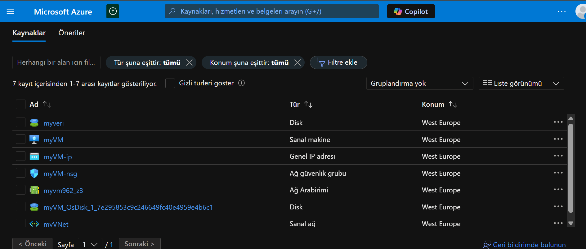
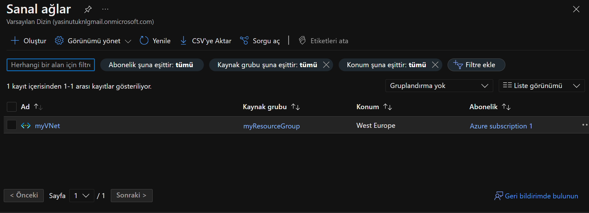
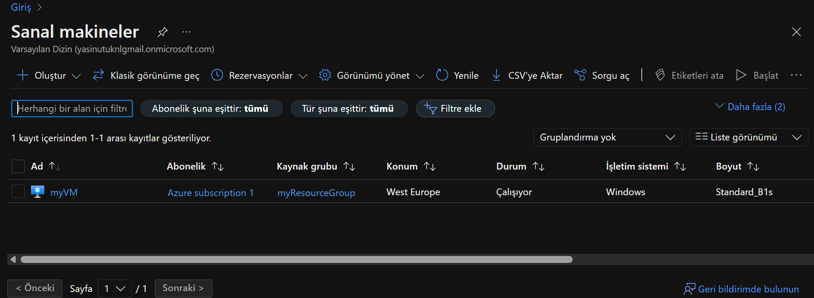
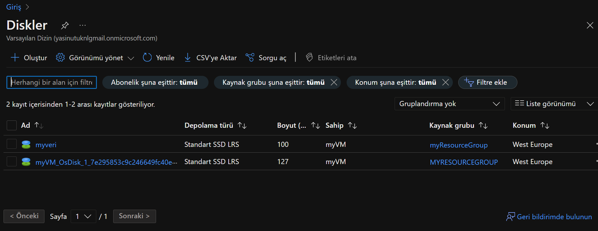
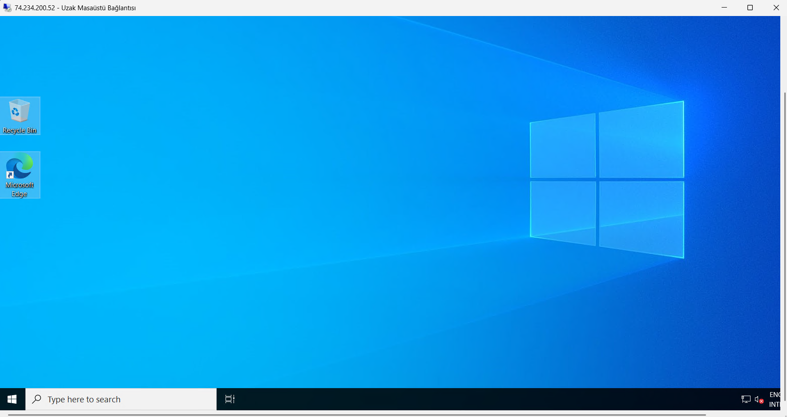
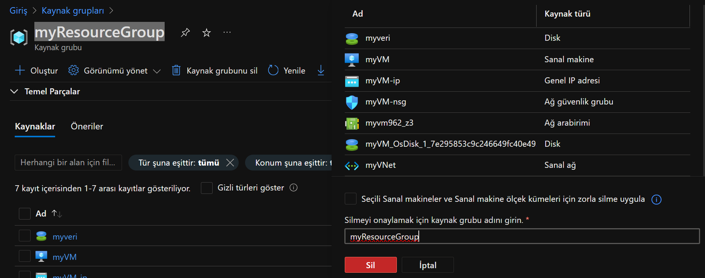

# Azure Sanal Makinesi Kurulum Ödevi

Bu depo, Azure üzerinde bir Windows Server sanal makinesi kurulumunu adım adım anlatmaktadır. Ödev kapsamında aşağıdaki adımlar gerçekleştirilmiştir:

1. **Kaynak Grubu Oluşturma**
2. **Sanal Ağ (VNet) Kurulumu**
3. **Windows Sanal Makinesi Dağıtımı**
4. **Sanal Makineye Veri Diski Bağlama**
5. **VM'ye RDP ile Bağlanma**
6. **Kaynakları Temizleme (İsteğe Bağlı)**

---

## Adım 1: Kaynak Grubu Oluşturma
Azure Portal'da yeni bir kaynak grubu oluşturuldu. Kaynak grubu, tüm Azure kaynaklarını organize etmek için kullanılır.

---

## Adım 2: Sanal Ağ (VNet) Kurulumu
Varsayılan alt ağ ile bir sanal ağ oluşturuldu. Sanal ağ, sanal makinelerin birbirleriyle ve dış dünyayla iletişim kurmasını sağlar.

---

## Adım 3: Windows Sanal Makinesi Dağıtımı
Ücretsiz katmana uygun bir Windows Server sanal makinesi oluşturuldu. Sanal makineye RDP erişimi için genel IP adresi atandı.

---

## Adım 4: Sanal Makineye Veri Diski Bağlama
Oluşturulan sanal makineye ek bir veri diski bağlandı. Bu disk, ek depolama alanı sağlar.

---

## Adım 5: VM'ye RDP ile Bağlanma
Sanal makineye, genel IP adresi kullanılarak Uzak Masaüstü Bağlantısı (RDP) ile bağlanıldı.

---

## Adım 6: Kaynakları Temizleme (İsteğe Bağlı)
Gereksiz ücretlendirmelerden kaçınmak için kaynak grubu ve tüm kaynaklar silindi.

---

---

## Nasıl Çalıştırılır?
1. Azure Portal'da oturum açın.
2. Adımları sırasıyla takip ederek sanal makineyi oluşturun.
3. RDP ile sanal makineye bağlanın.

---

## Katkıda Bulunma
Bu depo bir ödev kapsamında oluşturulmuştur. Katkıda bulunmak isterseniz, lütfen bir "Pull Request" açın.

---

## Lisans
Bu proje MIT lisansı altında lisanslanmıştır. Daha fazla bilgi için `LICENSE` dosyasına bakın.